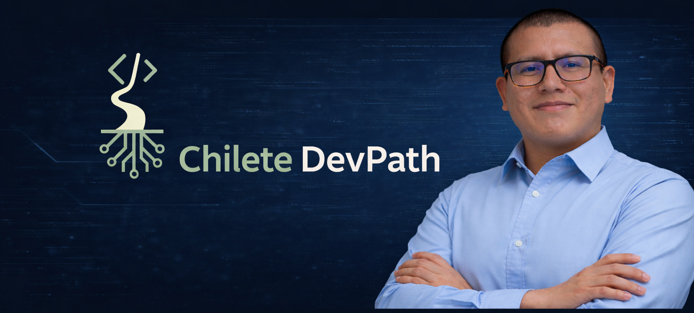

<p align="center">
  
</p>

# Adrian Pisco | Chilete DevPath

Ruta personal de aprendizaje en desarrollo de software.

Soy Adrian Pisco, estudiante de Ingenieria de Sistemas e Informatica. Chilete DevPath es mi marca personal para registrar mi avance paso a paso: fundamentos, practicas, proyectos academicos, colaboraciones y portafolio.


## Redes y contacto

<p>
  <a href="https://www.linkedin.com/in/adrian-pisco">
    
  </a>
  <a href="https://github.com/chiletedevpath">
    
  </a>
</p>

**Adrian Pisco** es mi identidad profesional como estudiante y futuro desarrollador.  
**Chilete DevPath** es mi marca personal para documentar aprendizaje, proyectos, colaboraciones y evolucion tecnica.

## En que estoy enfocado

- Fortalecer bases de programacion y pensamiento logico.
- Construir proyectos academicos bien documentados.
- Practicar backend con Java, Spring Boot y bases de datos.
- Mejorar frontend con HTML, CSS, JavaScript y React.
- Ordenar mi aprendizaje como evidencia profesional.

## Como esta organizado este GitHub

| Repositorio | Proposito |
|---|---|
| [aprendizaje](https://github.com/chiletedevpath/aprendizaje) | Ejercicios, apuntes y practicas desde lo basico hasta temas mas avanzados. |
| [academia](https://github.com/chiletedevpath/academia) | Mapa academico de cursos, ciclos y proyectos por institucion. |
| [colaboraciones](https://github.com/chiletedevpath/colaboraciones) | Registro de proyectos colaborativos y repositorios externos donde participo. |
| [portafolio](https://github.com/chiletedevpath/portafolio) | Seleccion de proyectos y base del sitio web personal. |

## Proyectos destacados

### UTP

| Curso | Proyecto | Tecnologias principales |
|---|---|---|
| Base de Datos II | [La Lucha BD Backend](https://github.com/chiletedevpath/utp-la-lucha-bd-backend) | Java, Spring Boot, PostgreSQL, SQL |
| Algoritmos y Estructuras de Datos | [Clinica Salud Vital](https://github.com/chiletedevpath/utp-clinica-salud-vital) | Java, POO, estructuras de datos |
| Base de Datos I | [Ferreteria Soto DB](https://github.com/chiletedevpath/utp-ferreteria-soto-db) | SQL Server, T-SQL, procedimientos, triggers |
| Patrones de Diseno | [Ferreteria Sys Patrones](https://github.com/chiletedevpath/utp-ferreteria-sys-patrones) | Java, POO, modelado por dominio |

### Tecsup

| Curso | Proyecto | Tecnologias principales |
|---|---|---|
| Fullstack con Java | [Backend Final Exam](https://github.com/chiletedevpath/tecsup-backend-final-exam) | Java, Spring Boot, PostgreSQL, microservicios |
| Fullstack con Java | [SUNAT Consulta](https://github.com/chiletedevpath/tecsup-sunat-consulta) | Java, Spring Boot, OpenFeign, H2 |
| Fullstack con Java | [CRUD React Productos](https://github.com/chiletedevpath/tecsup-crud-react-productos) | React, Vite, JavaScript, Fetch API |
| Fullstack con Java | [Frontend Retos](https://github.com/chiletedevpath/tecsup-frontend-retos) | HTML, CSS, JavaScript |

## Tecnologias en practica

```txt
Java
Spring Boot
PostgreSQL
SQL Server
T-SQL
HTML
CSS
JavaScript
React
Vite
Git y GitHub
PSeInt
```

## Forma de trabajo

- Cada proyecto importante vive en su propio repositorio.
- `academia` funciona como indice, no como contenedor de codigo duplicado.
- `aprendizaje` conserva ejercicios y practicas progresivas.
- `colaboraciones` documenta proyectos externos sin apropiarse del historial de otros repositorios.
- Los README se mantienen como documentos vivos: explican que es el proyecto, por que se hizo, tecnologias, ejecucion, aprendizajes y pendientes.
- La [politica editorial](POLITICA_EDITORIAL.md) define como se documentan autoria, fuentes, uso de IA, material academico y colaboraciones.

## Estado actual

Estoy construyendo una base ordenada para que mi GitHub refleje aprendizaje real, proyectos academicos y progreso tecnico continuo.

## Siguiente objetivo

Convertir **Chilete DevPath** en una web/marca que organice todo mi ecosistema de repositorios, y desarrollar mi portafolio personal como **Adrian Pisco**, donde se presenten mis proyectos mas representativos con evidencias, capturas y explicaciones claras.
