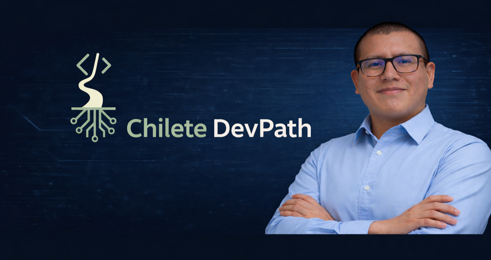

<p align="center">
  Espanol &nbsp;|&nbsp; <a href="README_EN.md">English</a>
</p>

<div align="center">



# Chilete DevPath

**Adrian Pisco**  
Estudiante de Ingenieria de Sistemas e Informatica

Construyo mi camino como desarrollador documentando aprendizaje real, practica tecnica y proyectos academicos/profesionales en evolucion.

<code>Java</code> · <code>Spring Boot</code> · <code>Frontend</code> · <code>Bases de Datos</code> · <code>Arquitectura</code>

</div>

---

## Sobre Mi

Soy estudiante de desarrollo de software en UTP, tambien complemento mi formacion con cursos de Tecsup y aprendizaje autodidacta. Mi enfoque actual es construir una base solida desde fundamentos, logica, POO, algoritmos y bases de datos, hasta backend, frontend y patrones de diseno.

Chilete DevPath es mi marca personal y mi vitrina tecnica: un espacio para mostrar progreso real, orden, criterio y mejora continua.

## En Que Estoy Trabajando

| Area | Enfoque actual |
|---|---|
| Fundamentos | Logica, pseudocodigo, variables, condicionales, bucles, arreglos y POO. |
| Backend | Java, Spring Boot, APIs REST, persistencia, validaciones y arquitectura por capas. |
| Frontend | HTML, CSS, JavaScript, React y construccion de interfaces web. |
| Bases de datos | Modelado, SQL Server, MySQL, PostgreSQL, consultas y proyectos academicos. |
| Arquitectura | Patrones de diseno, separacion de responsabilidades y documentacion tecnica. |

## Repositorios Principales

| Repositorio | Que representa |
|---|---|
| [learning-labs](https://github.com/chiletedevpath/learning-labs) | Laboratorio progresivo de aprendizaje, desde lo basico hasta temas avanzados. |
| [academic-projects](https://github.com/chiletedevpath/academic-projects) | Evidencia academica organizada por institucion, curso y proyecto. |
| [chilete-devpath](https://github.com/chiletedevpath/chilete-devpath) | Sitio web personal y base de mi portafolio profesional. |
| [chiletedevpath-roadmap](https://github.com/chiletedevpath/chiletedevpath-roadmap) | Ruta de aprendizaje, objetivos, seguimiento y evolucion tecnica. |

## Proyectos Que Representan Mi Evolucion

| Proyecto | Contexto | Aprendizaje principal |
|---|---|---|
| Ferreteria Soto DB | Proyecto final de Base de Datos I - UTP | Modelado relacional, scripts SQL, ventas, inventario y auditoria. |
| Ferreteria Sys Patrones | Proyecto de patrones de diseno - UTP | Aplicacion de principios y patrones sobre un dominio cercano. |
| ms-pedidos / ms-productos | Examen final backend - Tecsup | Microservicios Spring Boot, CRUD, validaciones, PostgreSQL, Docker y Render. |
| Chilete DevPath Website | Proyecto personal | Identidad profesional, frontend, documentacion y marca personal. |

## Stack En Desarrollo

<div align="center">


</div>

## Ruta Actual

```txt
Fundamentos -> POO -> Algoritmos -> Bases de Datos -> Backend -> Frontend -> Arquitectura -> Portafolio
```

Mi objetivo no es llenar GitHub de proyectos sueltos, sino construir una evidencia clara de progreso: que cada repositorio tenga proposito, documentacion y relacion con mi desarrollo profesional.

## Contacto

- Portfolio: https://chiletedevpath.github.io/chilete-devpath/
- GitHub: https://github.com/chiletedevpath
- LinkedIn: https://www.linkedin.com/in/adrian-ivan-pisco-soto-857235194/
- Instagram: https://www.instagram.com/chiletedevpath/
- Email: chiletedevpath@gmail.com

---

<div align="center">

**Chilete DevPath: aprendizaje real, codigo organizado y progreso documentado.**

</div>
