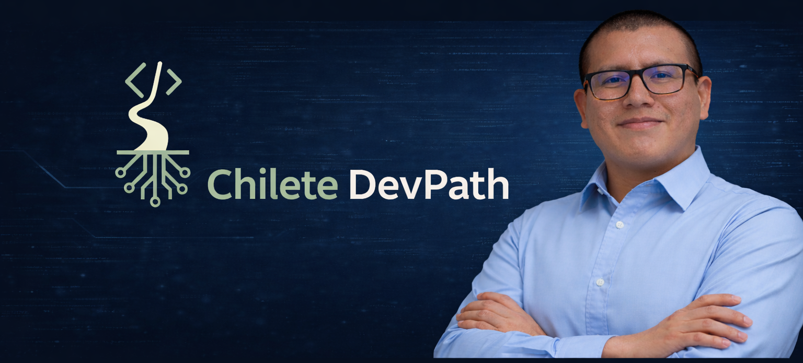

  

<h1 align="center">Chilete DevPath</h1>

  <strong>Aprendizaje tecnológico, práctica verificable y proyectos explicados con criterio.</strong> 
  Ecosistema creado por Adrián Pisco desde Chilete, Cajamarca, Perú.

  
  
  

---

## Qué es Chilete DevPath

**Chilete DevPath** es mi marca personal y ecosistema público de aprendizaje. Documento cómo estudio tecnologías, practico con intención y convierto lo aprendido en proyectos que pueden revisarse y explicarse.

El contenido se organiza con una regla sencilla: **comprender, practicar, construir, validar y publicar con criterio**. Cada avance debe mostrar contexto, evidencia y límites reales; una idea planificada no se presenta como trabajo terminado.

## Qué está publicado

La [web oficial](https://chiletedevpath.com/) funciona como entrada principal al ecosistema y actualmente presenta:

| Área | Estado verificable |
|---|---|
| Desarrollo de software | 10 de 12 módulos disponibles: fundamentos, programación, datos, web, patrones y backend. |
| Productividad y datos | 10 de 10 módulos disponibles con hojas de cálculo, fórmulas, análisis y modelos aplicados. |
| Proyectos | 9 casos documentados con problema, solución, tecnologías, aprendizaje y acceso a la evidencia. |
| Criterios | Autoría, privacidad, publicación segura, uso responsable de IA y bienestar técnico. |

Los módulos de frontend moderno y publicación/producción permanecen planificados. Se incorporarán cuando existan prácticas propias, revisadas y reproducibles.

## Cómo se relaciona el ecosistema

| Espacio | Responsabilidad |
|---|---|
| [Web oficial](https://chiletedevpath.com/) | Presenta las rutas, recursos, proyectos y criterios en una experiencia pública bilingüe. |
| [Aprendizaje](https://github.com/chiletedevpath/aprendizaje) | Conserva la ruta progresiva, sus conceptos, prácticas, retos y evidencias técnicas. |
| [Academia](https://github.com/chiletedevpath/academia) | Reúne proyectos formativos y aplicados con contexto, tecnologías, validación y límites. |
| [Chilete DevPath](https://github.com/chiletedevpath/chiletedevpath) | Mantiene la presentación de marca y las políticas que gobiernan el contenido público. |
| [Portafolio](https://github.com/chiletedevpath/portafolio) | Prepara una selección profesional futura; todavía no se presenta como portafolio final. |

La web resume y conecta el contenido; `aprendizaje` conserva la progresión didáctica y `academia` mantiene la evidencia completa. Esta separación evita duplicar información o convertir prácticas formativas en productos comerciales.

## Proyectos con contexto

Los proyectos publicados cubren programación, bases de datos, estructuras de datos, desarrollo web, patrones de diseño, backend, integración full stack y productividad con datos.

Cada caso responde cuatro preguntas:

1. ¿Qué problema se buscó resolver?
2. ¿Qué solución se construyó?
3. ¿Qué tecnologías y decisiones se aplicaron?
4. ¿Qué quedó validado y qué puede mejorar?

Puedes explorar el [catálogo público de proyectos](https://chiletedevpath.com/proyectos/) o consultar la [evidencia técnica en Academia](https://github.com/chiletedevpath/academia).

## Experiencia aplicada

**Ferretería Soto** es el primer cliente real que confió en Chilete DevPath para desarrollar una solución de gestión empresarial. El sistema se mantiene como software privado y avanza mediante pruebas controladas antes de operar con datos reales.

Su código, datos, accesos y operación interna no forman parte del ecosistema público. Solo se comparte información general o material autorizado que respete la privacidad del negocio.

## Criterios de publicación

- Mostrar evidencia verificable y declarar el estado real de cada trabajo.
- Diferenciar aprendizaje, proyecto formativo, selección profesional y trabajo privado.
- Proteger datos personales, credenciales, accesos e información de terceros.
- Reconocer fuentes y colaboraciones sin atribuir respaldo oficial.
- Usar IA como apoyo sujeto a revisión humana, no como sustituto del aprendizaje.
- Mantener un proceso sostenible que no normalice el agotamiento.

Consulta los [criterios publicados en la web](https://chiletedevpath.com/criterios/), las [políticas vigentes](docs/politicas/README.md) y el [checklist de publicación segura](docs/publicacion/CHECKLIST_PUBLICACION_SEGURA.md).

## Estado actual

Chilete DevPath cuenta con una web pública en español e inglés, dos rutas de aprendizaje, un catálogo de proyectos con evidencia enlazada y criterios de publicación integrados. El ecosistema continúa creciendo solo cuando el contenido puede revisarse, ejecutarse o justificarse con claridad.

---

  Construido desde Chilete, Cajamarca, Perú, con práctica real y criterio técnico.

